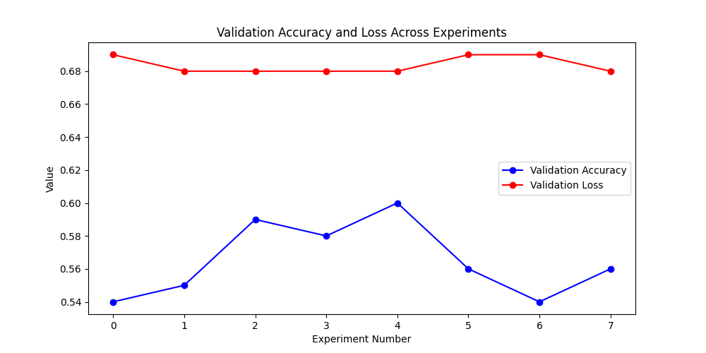

|   Exp No |   epoch |   train_acc_epoch |   val_acc |   test_acc |   val_loss |   test_loss | base_model    |   patch_size |   embed_dim |
|---------:|--------:|------------------:|----------:|-----------:|-----------:|------------:|:--------------|-------------:|------------:|
|        1 |       1 |          0.56684  |  0.553571 |   0.553571 |   0.684196 |    0.684196 | convnext_tiny |            8 |          48 |
|        2 |       1 |          0.56684  |  0.590402 |   0.590402 |   0.675182 |    0.675182 | convnext_tiny |            8 |          16 |
|        5 |       1 |          0.523438 |  0.55692  |   0.55692  |   0.687646 |    0.687646 | convnext_tiny |           16 |          16 |
|        4 |       1 |          0.524306 |  0.598214 |   0.598214 |   0.682196 |    0.682196 | convnext_tiny |           16 |          16 |
|        7 |       1 |          0.557292 |  0.560268 |   0.560268 |   0.682763 |    0.682763 | convnext_tiny |           16 |          48 |
|        6 |       1 |          0.554688 |  0.539062 |   0.539062 |   0.688256 |    0.688256 | convnext_tiny |           16 |          32 |
|        3 |       1 |          0.541667 |  0.578125 |   0.584821 |   0.678451 |    0.686752 | convnext_tiny |           32 |          16 |
|        0 |       1 |          0.524306 |  0.541295 |   0.541295 |   0.687328 |    0.687328 | convnext_tiny |            8 |          32 |

